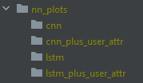
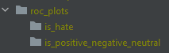

# Hate Speech Detection on Twitter
In this research, we will try to detect hatespeech in twitter, analyzing the user's profile using any metrics we may find useful. 

## Dataset
For our research we 'll create a custom dataset, using basically three steps.

### First scraping
We firstly collect the tweets using `data_scrapper.py`. The approach to collect
data is the following:
1. we have found a controversial term (i.e #Trump), which we use to scrape tweets using the twitter api.
2. we keep the tweets id and classify them as hateful or not (binary 1/0).

### Information extraction
Some data from the dataset were inaccessible after the first extraction period. Therefore, we use 
`extract_tweet_user_data.py` to obtain our new dataset `tweet_user_data.csv`. 
The dataset includes the following information:
* tweet_id
* tweet_retweets
* tweet_likes
* tweet_is_reply
* user_following
* user_followers
* user_total_tweets
* is_hate
* is_positive_negative_neutral
* tweet_text
##### Note: To comply with Twitter's legal terms, we only upload the tweet id and the classification label.

### Final dataset creation
Finally, in order to avoid biased results we: 
1. removed duplicate tweets. 
2. kept only distinct users in our dataset (`/dataset/tweet_user_data_final.csv`). 

## Usage
Usage is basically split in three folders depending on what type of classification you wish to try.
Thus, you can refer to:
* the `text_classification` directory, in order to use deep learning for text
classification.
* the `user_attributes_classification` directory, to try to classify tweets depending on user's data.
* the `multiple_attributes_classification` directory, to try to combine text and user attributes classification.

### Text classification
To use text classification you should use the files in the `text_classification` directory:
1. go to `classification_config.py` and specify the required data. Specifically you can choose:
   * embedding dimension of the vectors.
   * test dataset size.
   * epochs.
   * validation dataset size.
2. simply run one of the files `cnn.py`, `lstm.py`,
in order to use one of the equivalent neural networks to train the dataset and test it.
   
### Combined attributes classification
To use combined classification (text and user attributes), you have to go to the `multiple_attributes_classification` directory
and do the following:
1. go to `classification_config.py` and choose:
   * embedding dimension of the vectors.
   * test dataset size.
   * epochs.
   * validation dataset size.     
   * you have to choose the user attributes you wish to use alongside tweet's text to train
     your dataset with.
2. run one of the files `cnn_plus_user_attriutes.py`, `lstm_plus_user_attriutes.py`,
in order to use one of the equivalent neural networks to train the dataset and test it.

## Extra Notes:
* Make sure to create the directory structures under project root (i.e alongside with 
  directories `text_classification`, `dataset` etc.) in the following form:
   1. For the neural networks plots:
      
      
   2. For the roc plots:
   
      